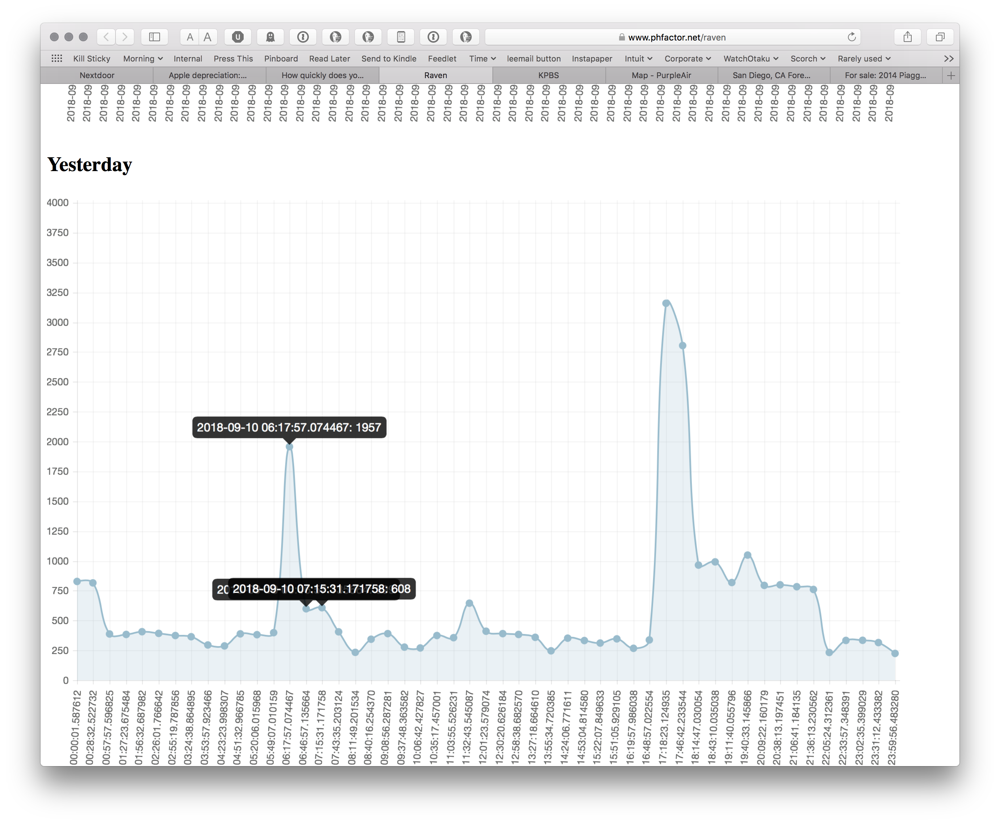

## Raven

This is a 2-part system for capturing and displaying electrical power consumption data from my house. I have an [SDG&E](https://sdge.com) 'smart' meter and a [Raven Zigbee USB radio]() for hardware. This code has a USB/serial listener that saves data to a SQLite database and a Flask/D3.js front end that simply display today's and yesterdays' usage. 

Pretty simple.

