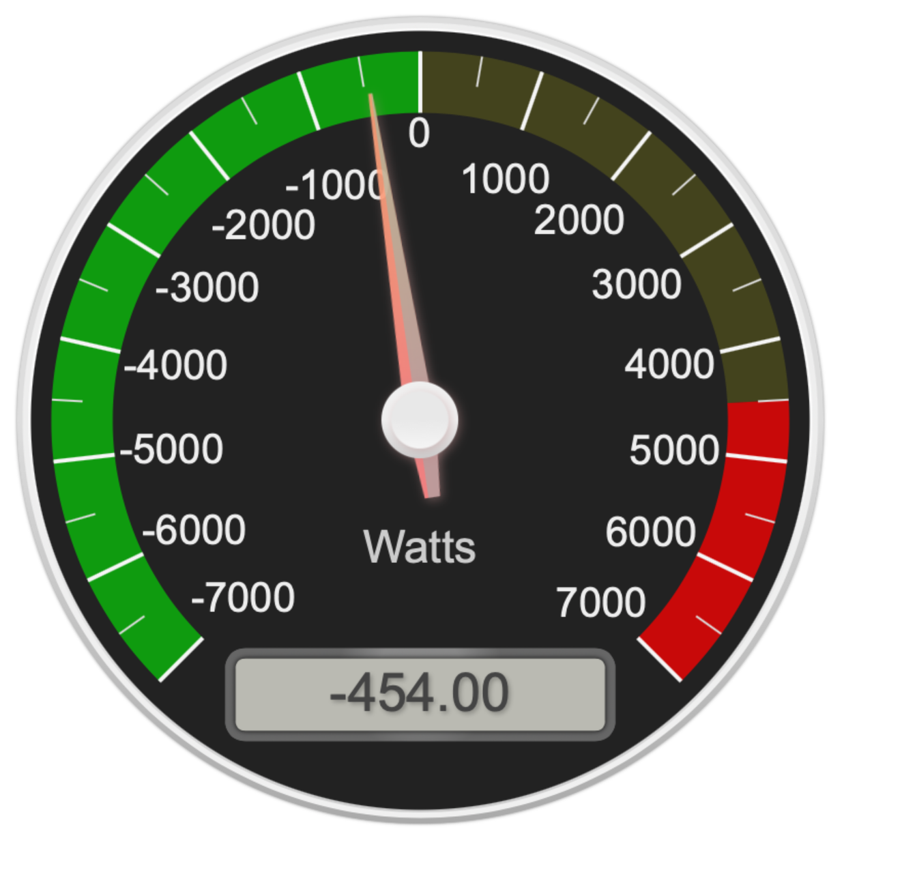
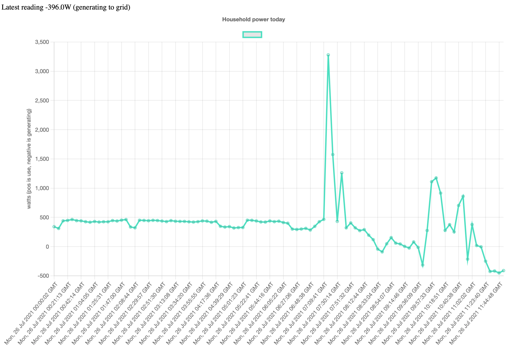
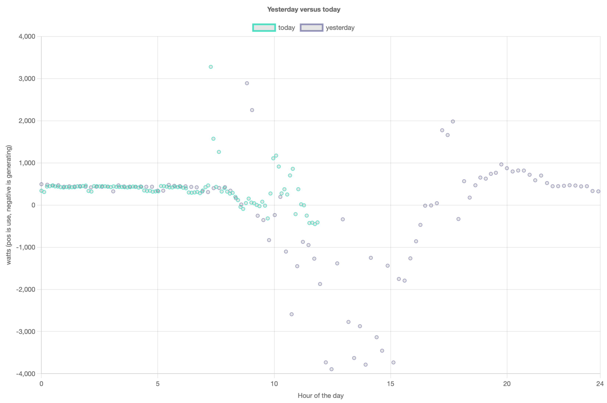

## Raven

This is a 2-part system for capturing and displaying electrical power consumption data from my house. I have an [SDG&E](https://sdge.com) 'smart' meter and a [Raven Zigbee USB radio](https://rainforestautomation.com/our-products/) for hardware. This code has a USB/serial listener that saves data to a SQLite database and a Flask/D3.js front end that simply display today's and yesterdays' usage. 

Pretty simple. There are three canned visualizations that cover my needs. A gauge that updates (using the js setInterval timer) every five seconds:

A graph of today's data, decimate to plot one hundred data points, plus a top line about the latest update:

Lastly, a display of today versus yesterday, again decimated down to 100 points per day:

Way more is possible, of course, but for now those are self-hosted, reliable and suffice.

## Setup and install

Unfortunately, it appears that you can't buy the Raven radio any more, so that rather blocks development. Open an issue if that changes and I'll take the time to document it.

## Alternatives

[This SDR project](https://www.rtl-sdr.com/reading-household-wireless-utility-meters-with-an-rtl-sdr-and-plotting-the-data-in-home-automation-software/) looks promising.
